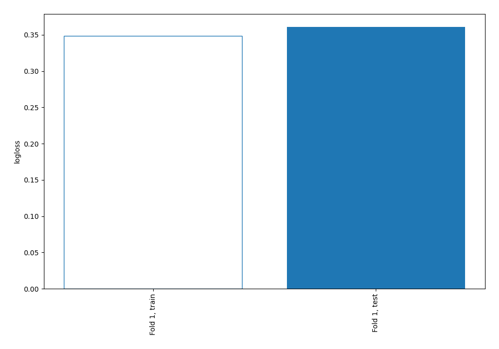
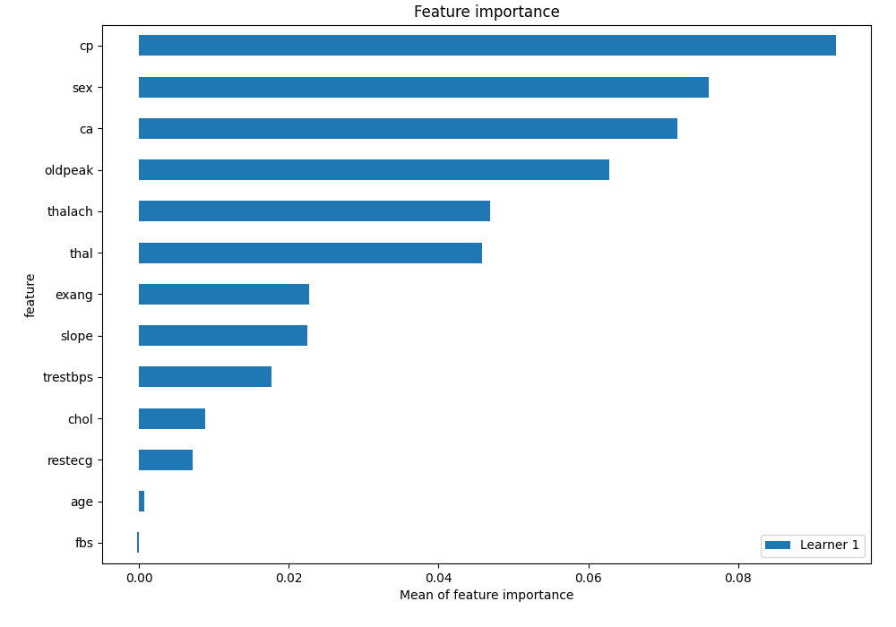
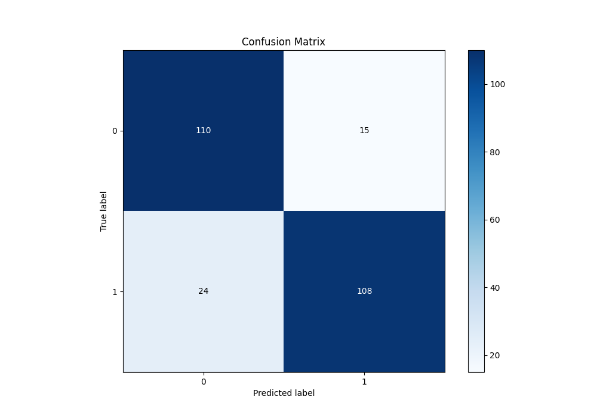
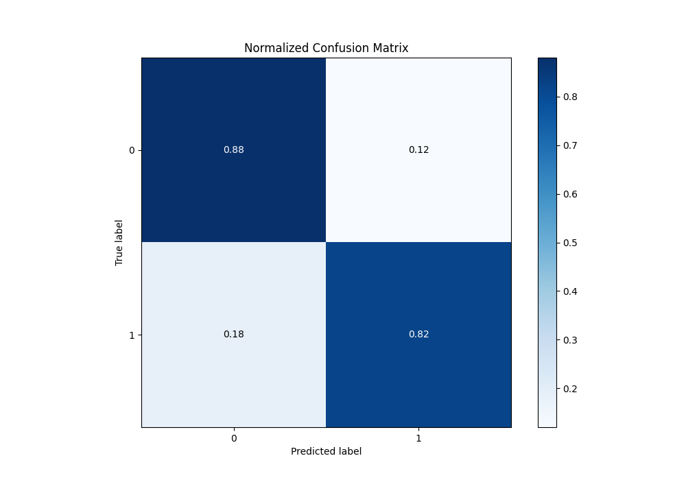
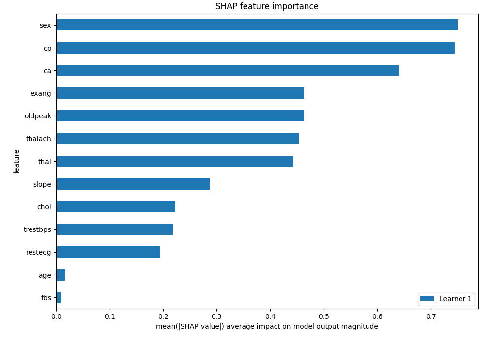
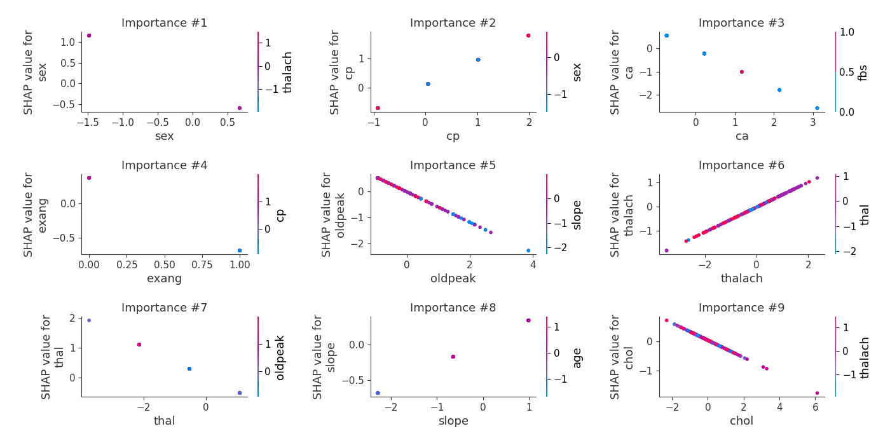
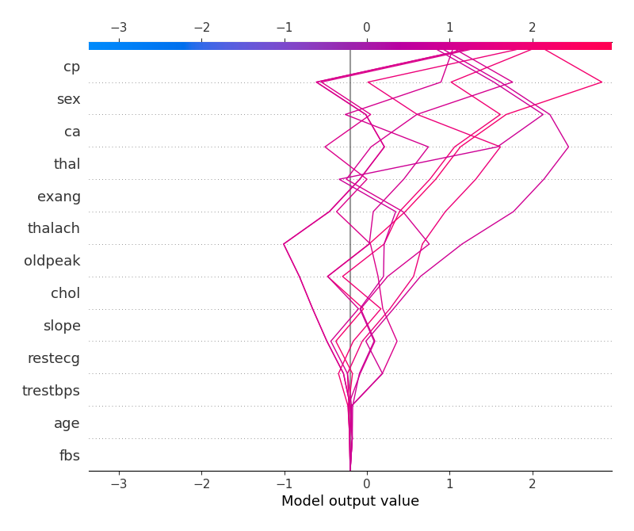
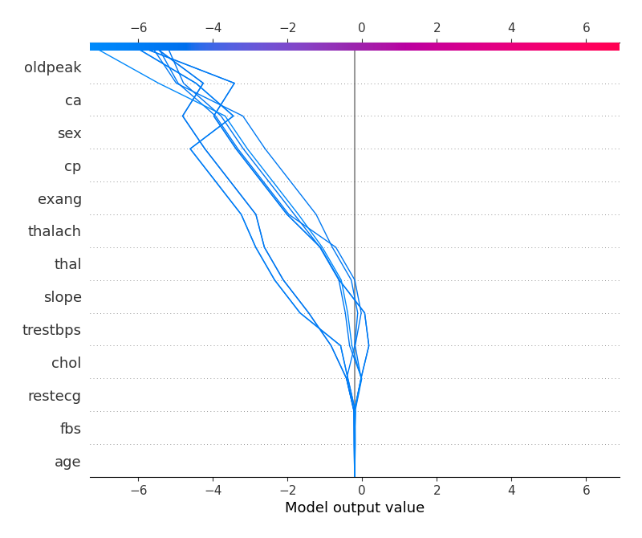
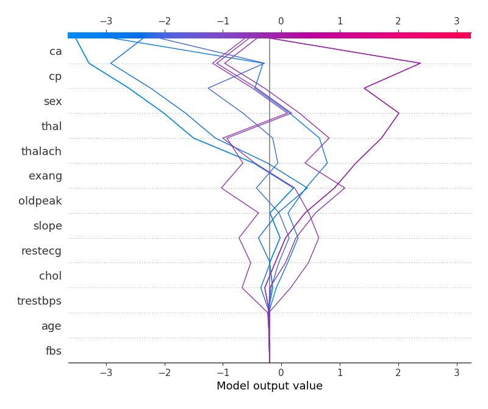
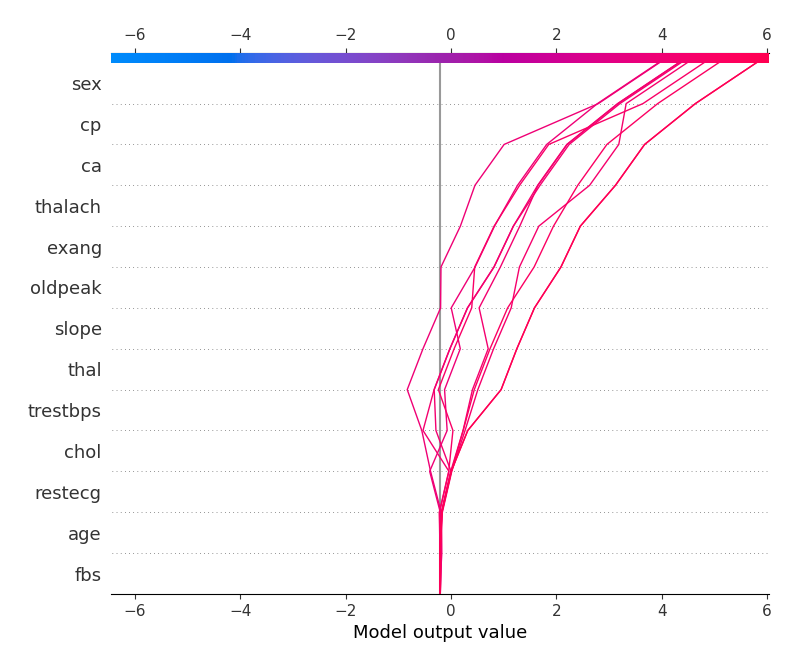

# Summary of 3_Linear

[<< Go back](../README.md)

## Logistic Regression (Linear)
- **n_jobs**: -1
- **explain_level**: 2

## Validation
 - **validation_type**: split
 - **train_ratio**: 0.75
 - **shuffle**: True
 - **stratify**: True

## Optimized metric
logloss

## Training time

4.8 seconds

## Metric details
|           |    score |     threshold |
|:----------|---------:|--------------:|
| logloss   | 0.360849 | nan           |
| auc       | 0.922667 | nan           |
| f1        | 0.856115 |   0.551133    |
| accuracy  | 0.848249 |   0.634548    |
| precision | 0.965909 |   0.776471    |
| recall    | 1        |   0.000795247 |
| mcc       | 0.698563 |   0.634548    |

## Metric details with threshold from accuracy metric
|           |    score |   threshold |
|:----------|---------:|------------:|
| logloss   | 0.360849 |  nan        |
| auc       | 0.922667 |  nan        |
| f1        | 0.847059 |    0.634548 |
| accuracy  | 0.848249 |    0.634548 |
| precision | 0.878049 |    0.634548 |
| recall    | 0.818182 |    0.634548 |
| mcc       | 0.698563 |    0.634548 |

## Confusion matrix (at threshold=0.634548)
|              |   Predicted as 0 |   Predicted as 1 |
|:-------------|-----------------:|-----------------:|
| Labeled as 0 |              110 |               15 |
| Labeled as 1 |               24 |              108 |

## Learning curves

## Coefficients
| feature   |   Learner_1 |
|:----------|------------:|
| cp        |   0.850174  |
| thalach   |   0.515216  |
| slope     |   0.309876  |
| intercept |   0.252296  |
| restecg   |   0.200914  |
| fbs       |   0.0302975 |
| age       |  -0.0203246 |
| trestbps  |  -0.28331   |
| chol      |  -0.298116  |
| thal      |  -0.501946  |
| oldpeak   |  -0.580821  |
| ca        |  -0.808055  |
| sex       |  -0.813567  |
| exang     |  -1.05073   |

## Permutation-based Importance

## Confusion Matrix

## Normalized Confusion Matrix

## SHAP Importance

## SHAP Dependence plots

### Dependence (Fold 1)

## SHAP Decision plots

### Top-10 Worst decisions for class 0 (Fold 1)

### Top-10 Best decisions for class 0 (Fold 1)

### Top-10 Worst decisions for class 1 (Fold 1)

### Top-10 Best decisions for class 1 (Fold 1)

[<< Go back](../README.md)
