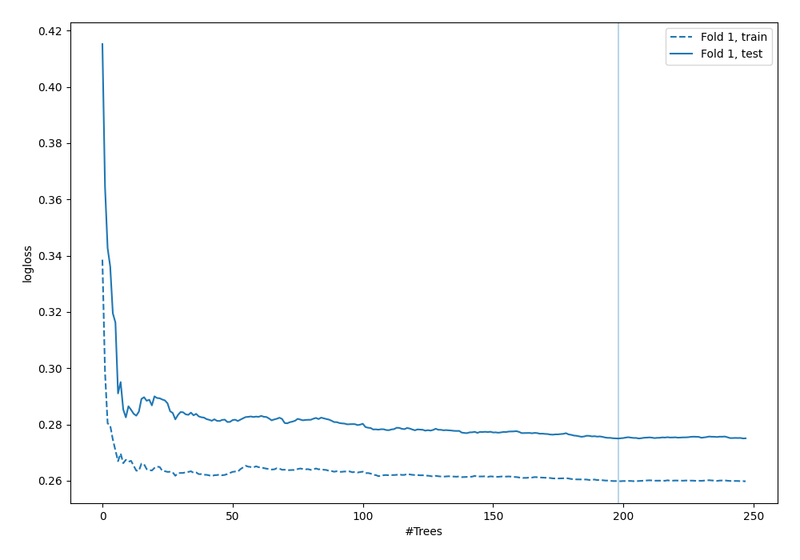
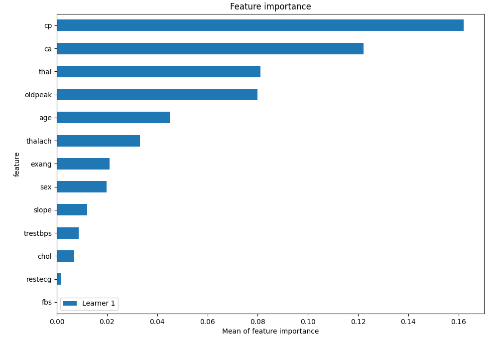
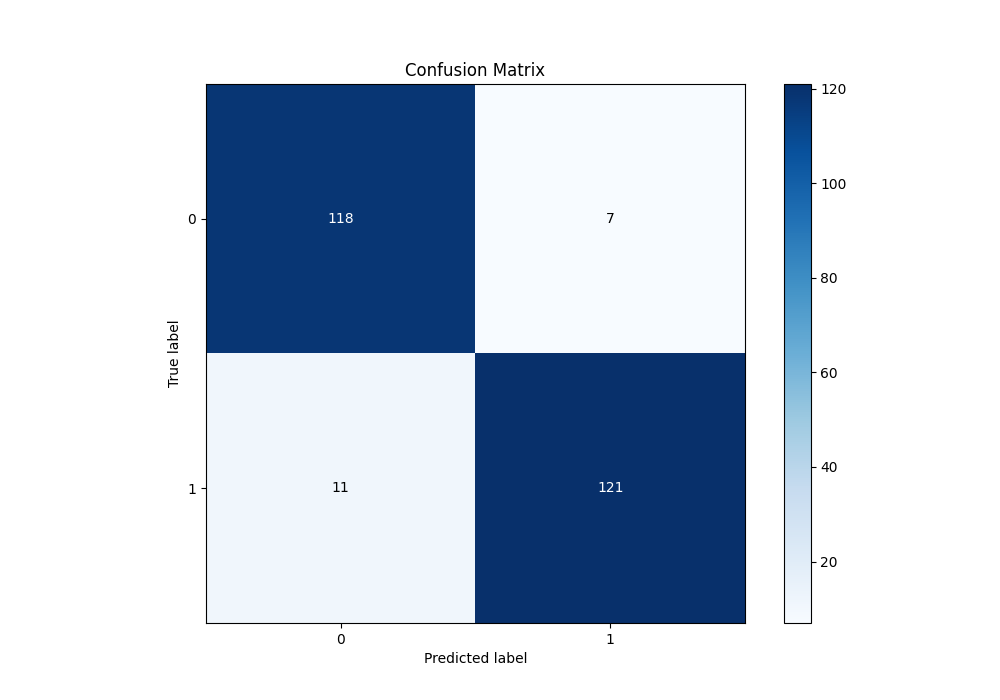
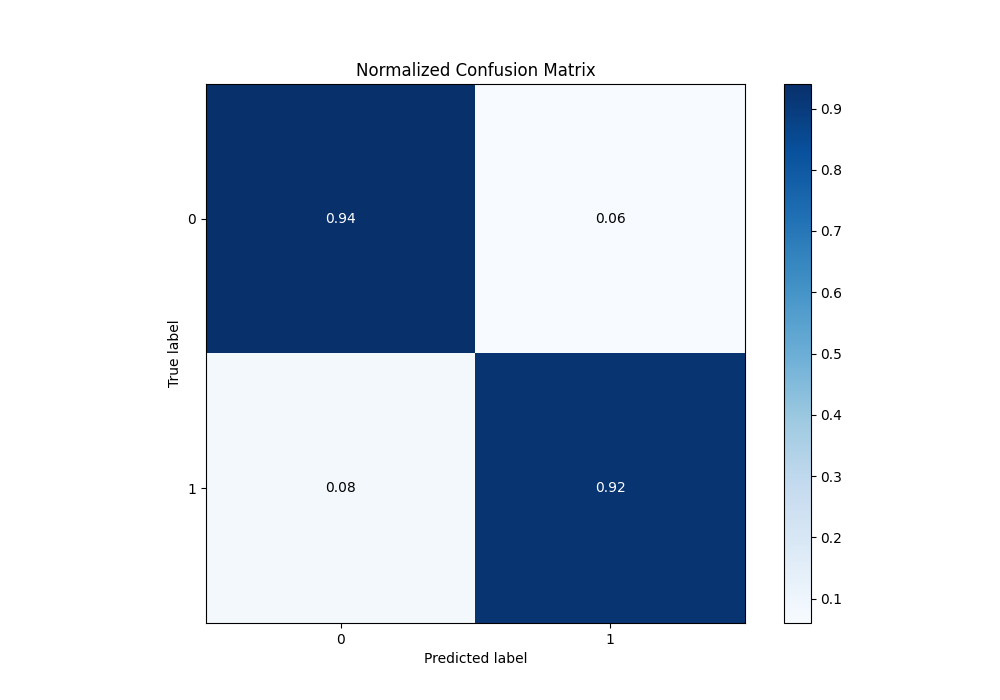

# Summary of 6_Default_RandomForest

[<< Go back](../README.md)

## Random Forest
- **n_jobs**: -1
- **criterion**: gini
- **max_features**: 0.9
- **min_samples_split**: 30
- **max_depth**: 4
- **eval_metric_name**: logloss
- **explain_level**: 2

## Validation
 - **validation_type**: split
 - **train_ratio**: 0.75
 - **shuffle**: True
 - **stratify**: True

## Optimized metric
logloss

## Training time

6.3 seconds

## Metric details
|           |    score |    threshold |
|:----------|---------:|-------------:|
| logloss   | 0.274996 | nan          |
| auc       | 0.972727 | nan          |
| f1        | 0.930769 |   0.63085    |
| accuracy  | 0.929961 |   0.63085    |
| precision | 1        |   0.81346    |
| recall    | 1        |   0.00626809 |
| mcc       | 0.860354 |   0.63085    |

## Metric details with threshold from accuracy metric
|           |    score |   threshold |
|:----------|---------:|------------:|
| logloss   | 0.274996 |   nan       |
| auc       | 0.972727 |   nan       |
| f1        | 0.930769 |     0.63085 |
| accuracy  | 0.929961 |     0.63085 |
| precision | 0.945312 |     0.63085 |
| recall    | 0.916667 |     0.63085 |
| mcc       | 0.860354 |     0.63085 |

## Confusion matrix (at threshold=0.63085)
|              |   Predicted as 0 |   Predicted as 1 |
|:-------------|-----------------:|-----------------:|
| Labeled as 0 |              118 |                7 |
| Labeled as 1 |               11 |              121 |

## Learning curves

## Permutation-based Importance

## Confusion Matrix

## Normalized Confusion Matrix

[<< Go back](../README.md)
