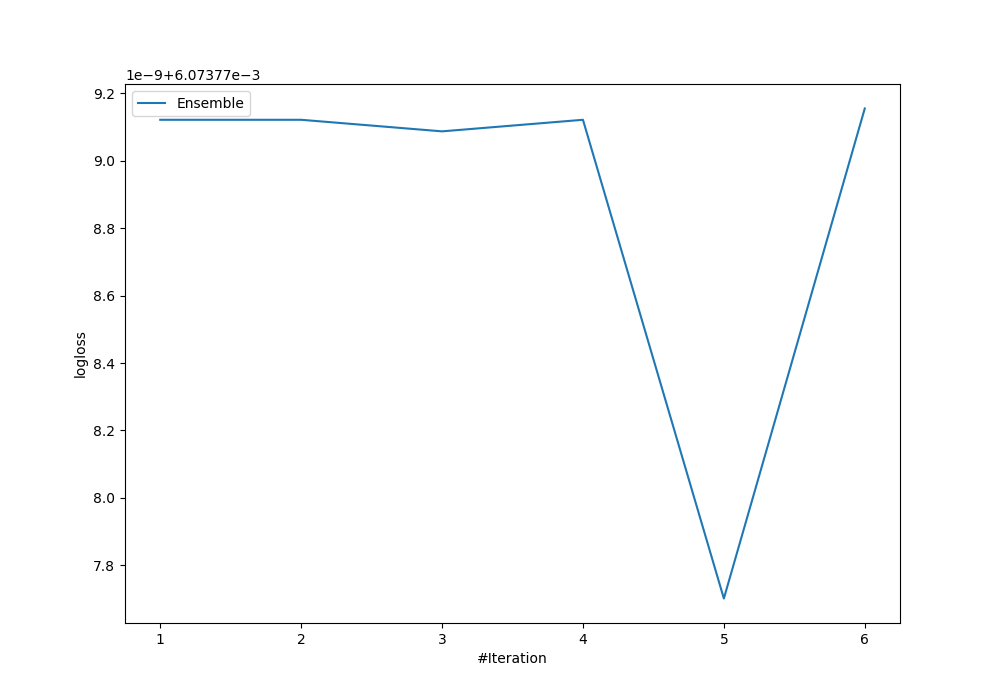
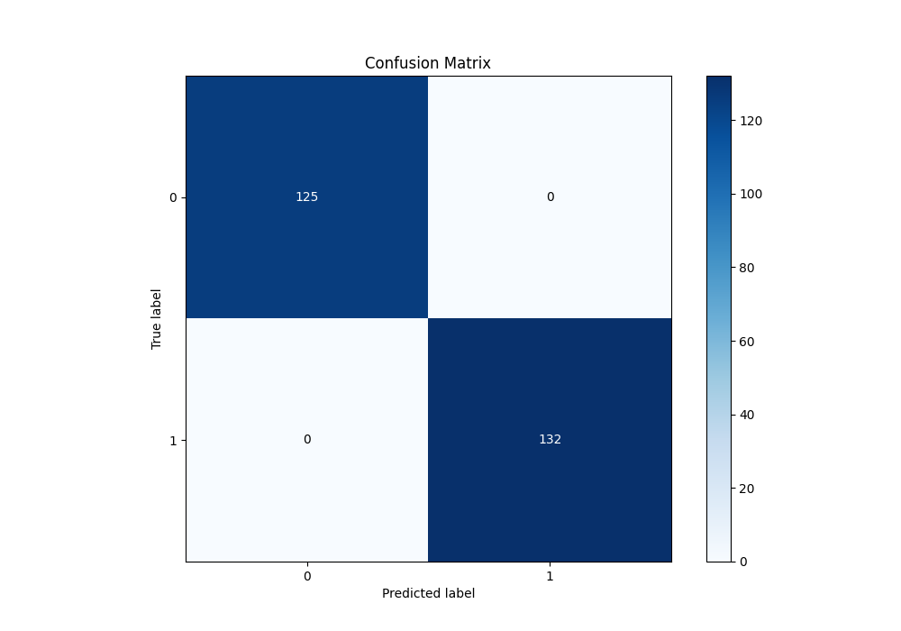
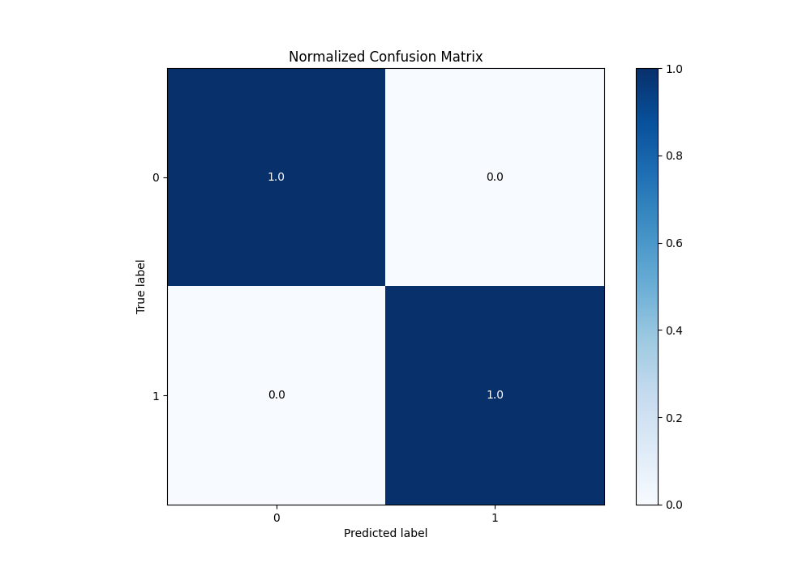

# Summary of Ensemble

[<< Go back](../README.md)

## Ensemble structure
| Model             |   Weight |
|:------------------|---------:|
| 4_Default_Xgboost |        5 |

## Metric details
|           |      score |     threshold |
|:----------|-----------:|--------------:|
| logloss   | 0.00607378 | nan           |
| auc       | 1          | nan           |
| f1        | 1          |   0.0340495   |
| accuracy  | 1          |   0.0340495   |
| precision | 1          |   0.0340495   |
| recall    | 1          |   1.97416e-06 |
| mcc       | 1          |   0.0340495   |

## Metric details with threshold from accuracy metric
|           |      score |   threshold |
|:----------|-----------:|------------:|
| logloss   | 0.00607378 | nan         |
| auc       | 1          | nan         |
| f1        | 1          |   0.0340495 |
| accuracy  | 1          |   0.0340495 |
| precision | 1          |   0.0340495 |
| recall    | 1          |   0.0340495 |
| mcc       | 1          |   0.0340495 |

## Confusion matrix (at threshold=0.03405)
|              |   Predicted as 0 |   Predicted as 1 |
|:-------------|-----------------:|-----------------:|
| Labeled as 0 |              125 |                0 |
| Labeled as 1 |                0 |              132 |

## Learning curves

## Confusion Matrix

## Normalized Confusion Matrix

[<< Go back](../README.md)
