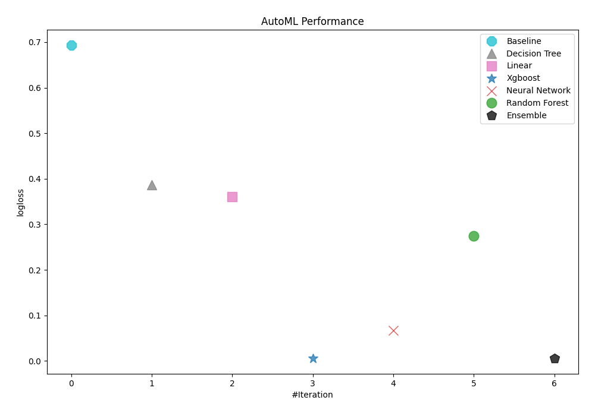
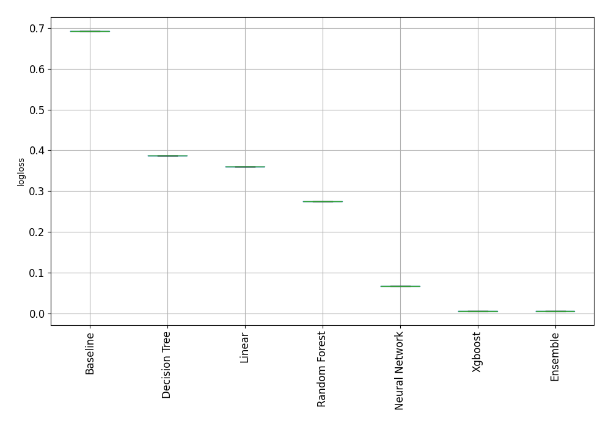
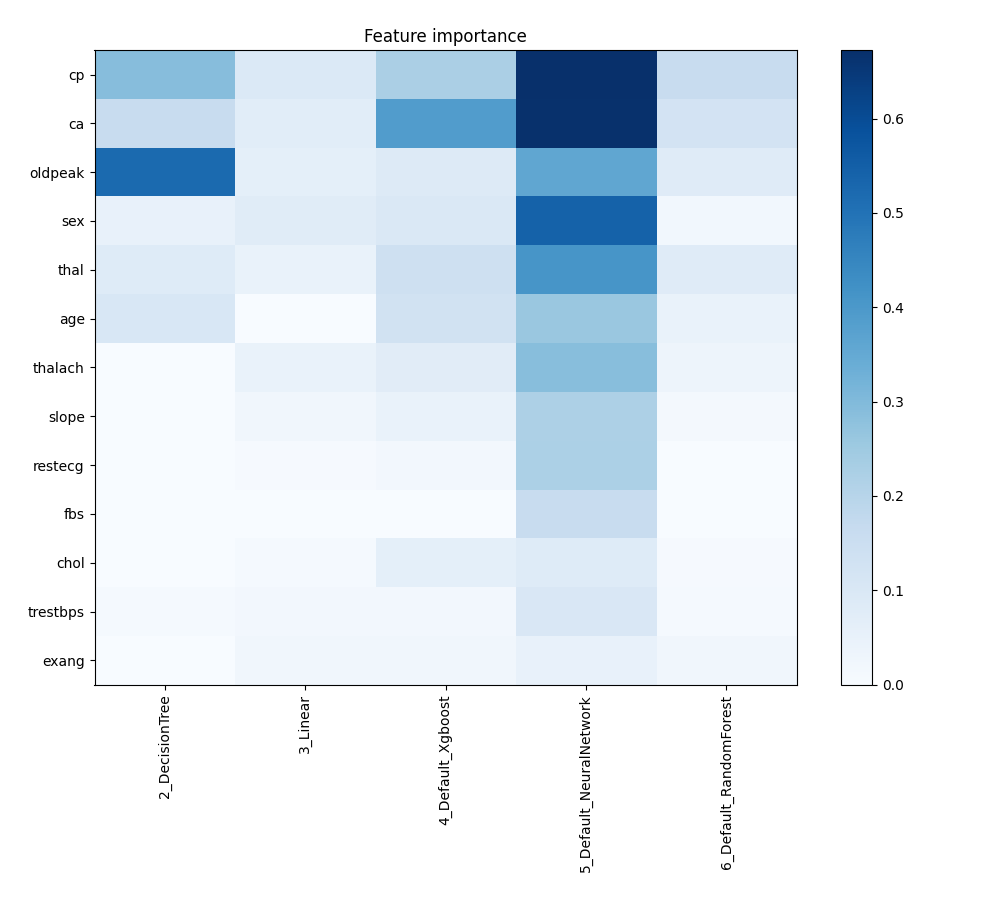
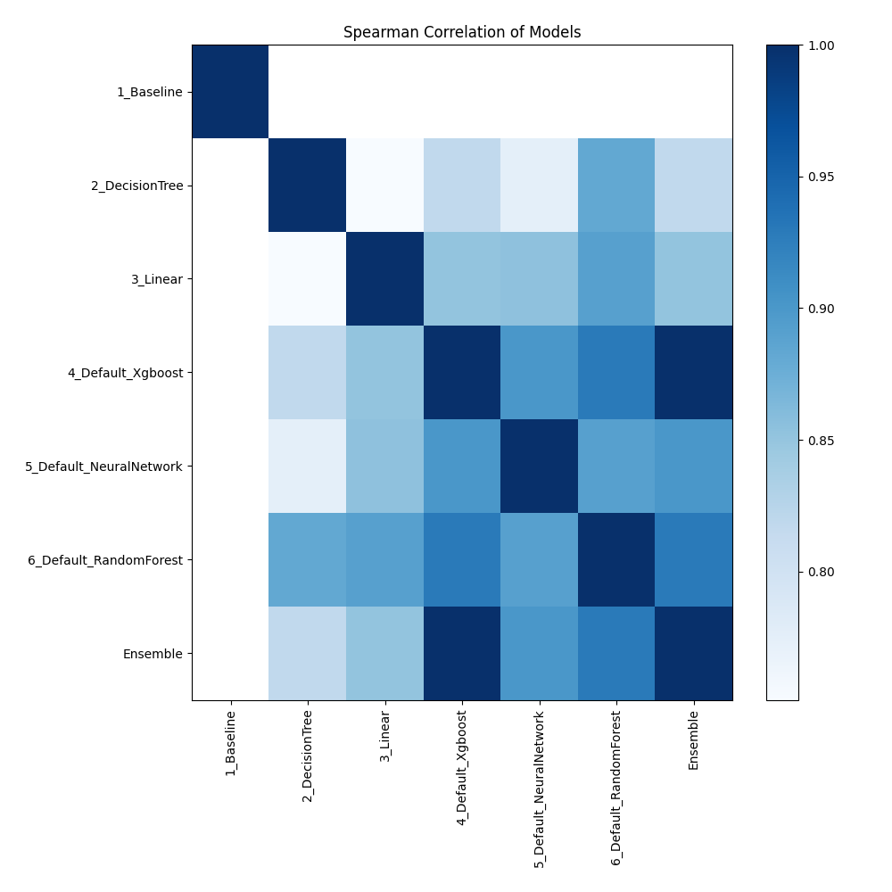

# AutoML Leaderboard

| Best model   | name                                                         | model_type     | metric_type   |   metric_value |   train_time |
|:-------------|:-------------------------------------------------------------|:---------------|:--------------|---------------:|-------------:|
|              | [1_Baseline](1_Baseline/README.md)                           | Baseline       | logloss       |     0.692777   |         0.65 |
|              | [2_DecisionTree](2_DecisionTree/README.md)                   | Decision Tree  | logloss       |     0.38683    |         7.46 |
|              | [3_Linear](3_Linear/README.md)                               | Linear         | logloss       |     0.360849   |         5.42 |
| **the best** | [4_Default_Xgboost](4_Default_Xgboost/README.md)             | Xgboost        | logloss       |     0.00607378 |        13.4  |
|              | [5_Default_NeuralNetwork](5_Default_NeuralNetwork/README.md) | Neural Network | logloss       |     0.0671897  |         2.89 |
|              | [6_Default_RandomForest](6_Default_RandomForest/README.md)   | Random Forest  | logloss       |     0.274996   |         6.55 |
|              | [Ensemble](Ensemble/README.md)                               | Ensemble       | logloss       |     0.00607378 |         2.04 |

### AutoML Performance

### AutoML Performance Boxplot

### Features Importance

### Spearman Correlation of Models

