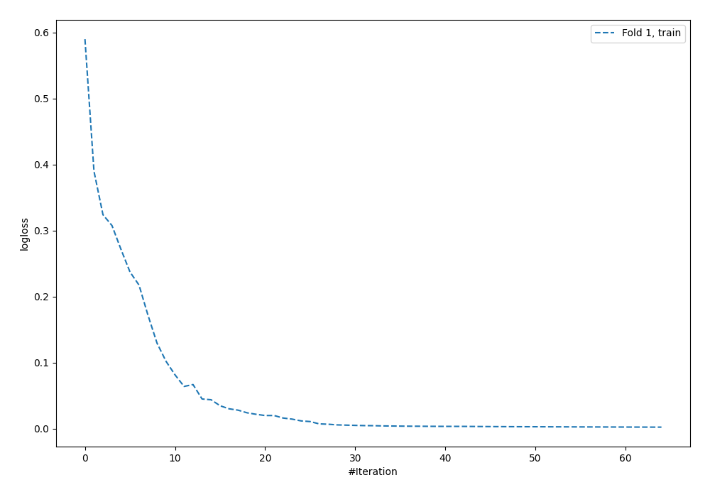
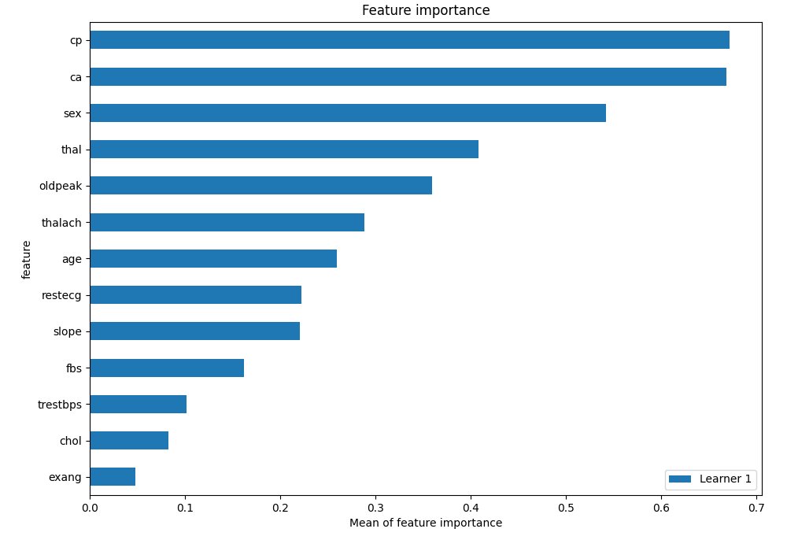
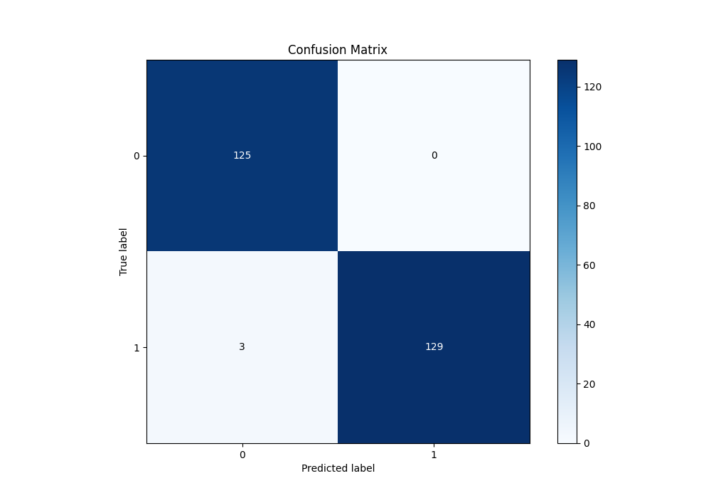
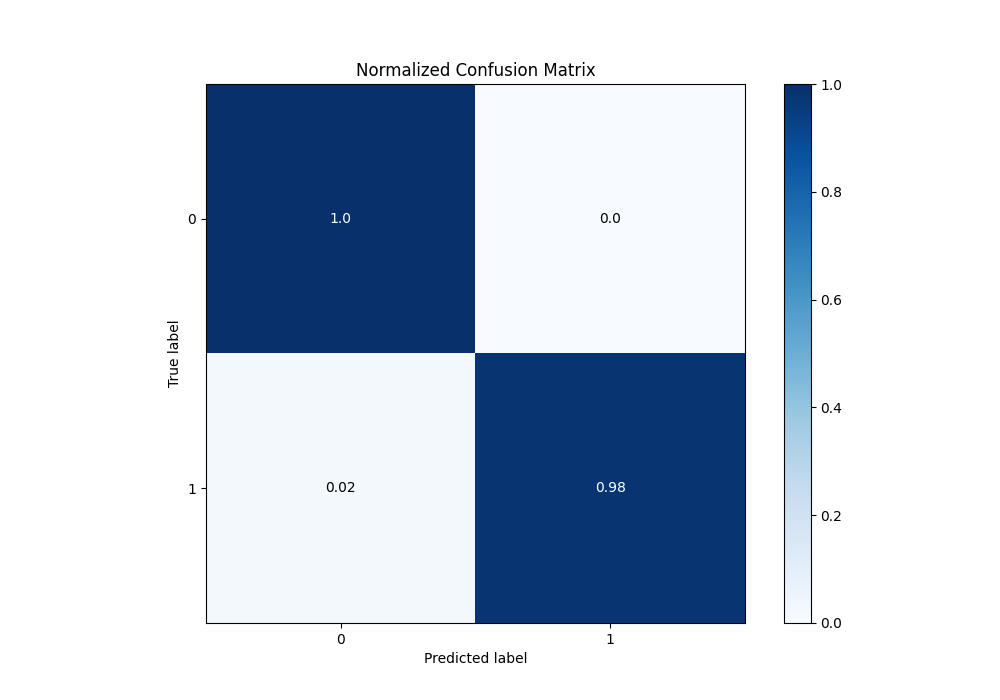

# Summary of 5_Default_NeuralNetwork

[<< Go back](../README.md)

## Neural Network
- **n_jobs**: -1
- **dense_1_size**: 32
- **dense_2_size**: 16
- **learning_rate**: 0.05
- **explain_level**: 2

## Validation
 - **validation_type**: split
 - **train_ratio**: 0.75
 - **shuffle**: True
 - **stratify**: True

## Optimized metric
logloss

## Training time

1.0 seconds

## Metric details
|           |     score |     threshold |
|:----------|----------:|--------------:|
| logloss   | 0.0671897 | nan           |
| auc       | 0.998545  | nan           |
| f1        | 0.988506  |   0.595261    |
| accuracy  | 0.988327  |   0.595261    |
| precision | 1         |   0.595261    |
| recall    | 1         |   1.30003e-20 |
| mcc       | 0.976918  |   0.595261    |

## Metric details with threshold from accuracy metric
|           |     score |   threshold |
|:----------|----------:|------------:|
| logloss   | 0.0671897 |  nan        |
| auc       | 0.998545  |  nan        |
| f1        | 0.988506  |    0.595261 |
| accuracy  | 0.988327  |    0.595261 |
| precision | 1         |    0.595261 |
| recall    | 0.977273  |    0.595261 |
| mcc       | 0.976918  |    0.595261 |

## Confusion matrix (at threshold=0.595261)
|              |   Predicted as 0 |   Predicted as 1 |
|:-------------|-----------------:|-----------------:|
| Labeled as 0 |              125 |                0 |
| Labeled as 1 |                3 |              129 |

## Learning curves

## Permutation-based Importance

## Confusion Matrix

## Normalized Confusion Matrix

[<< Go back](../README.md)
