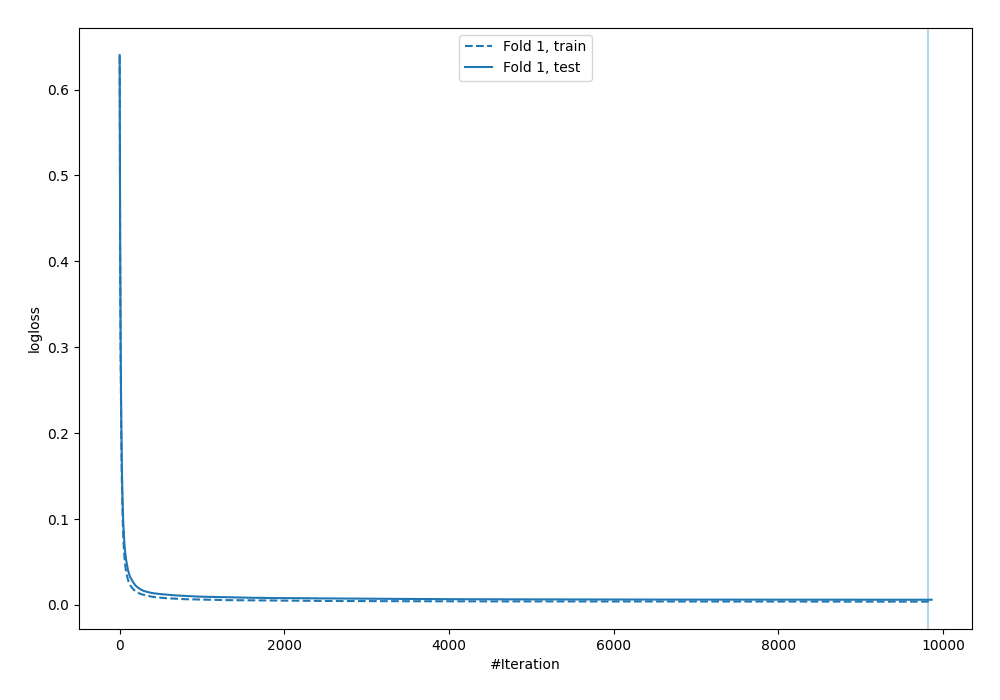
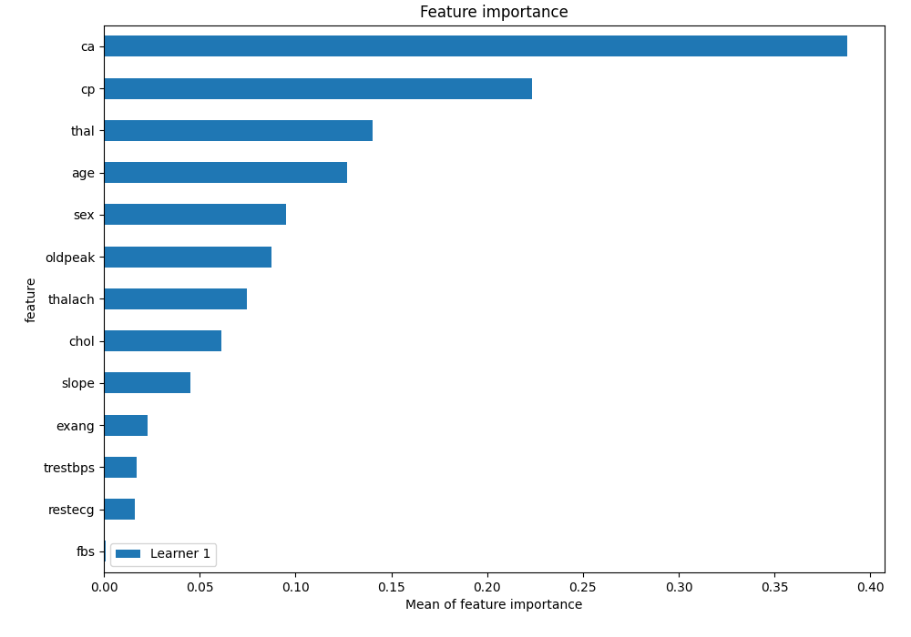
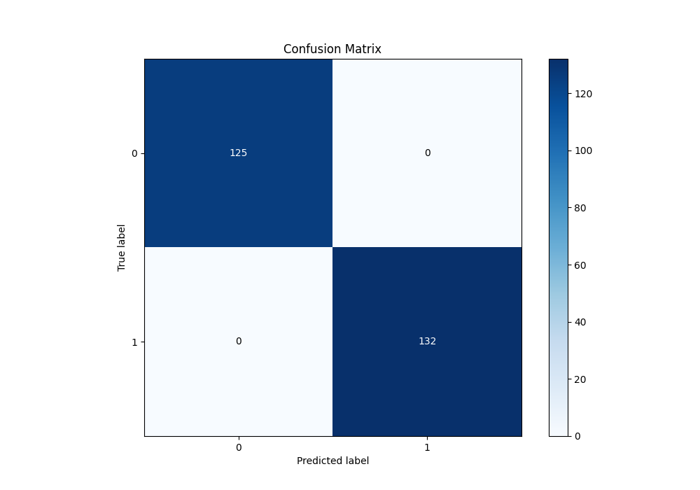
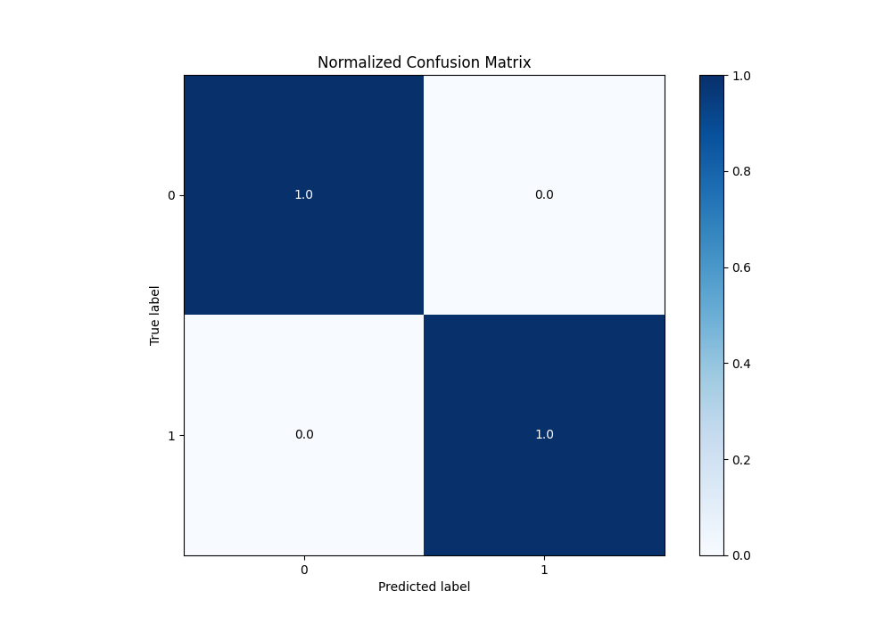
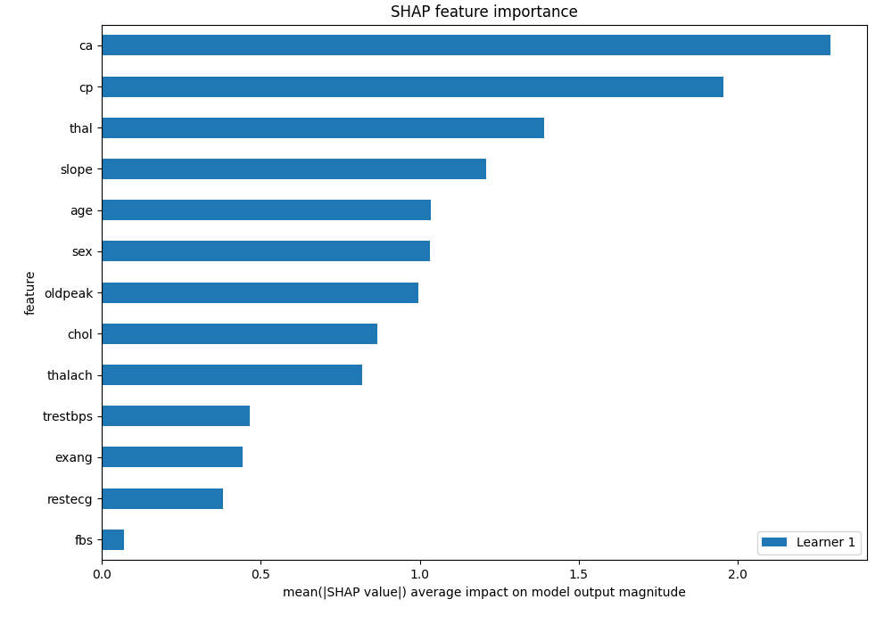
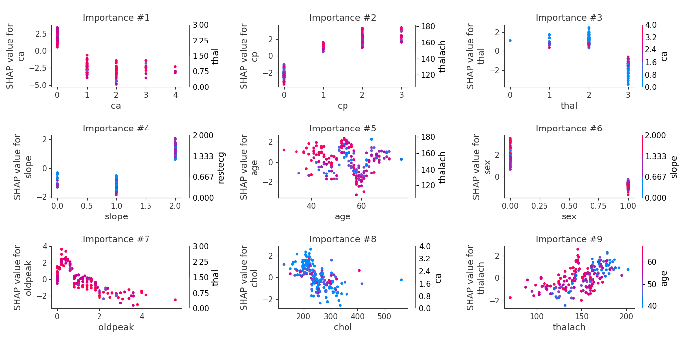
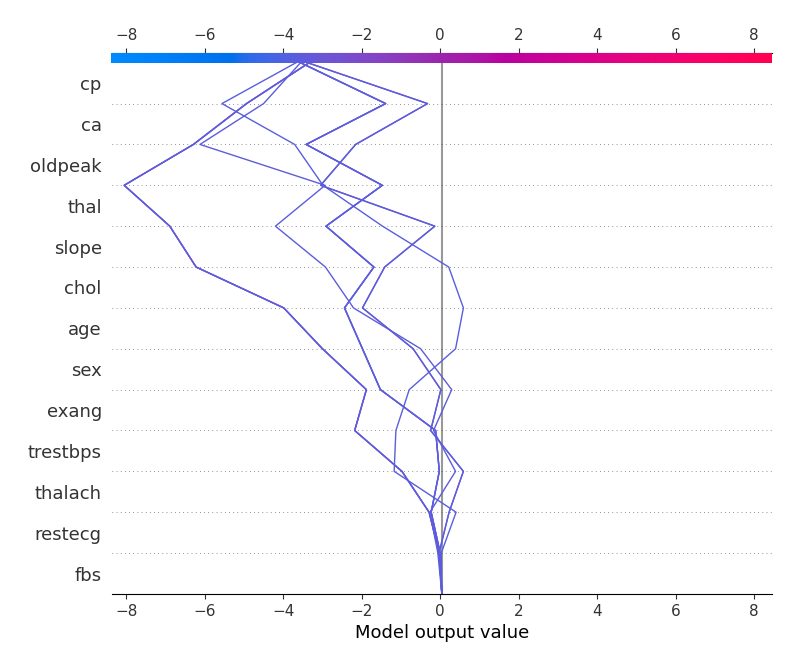
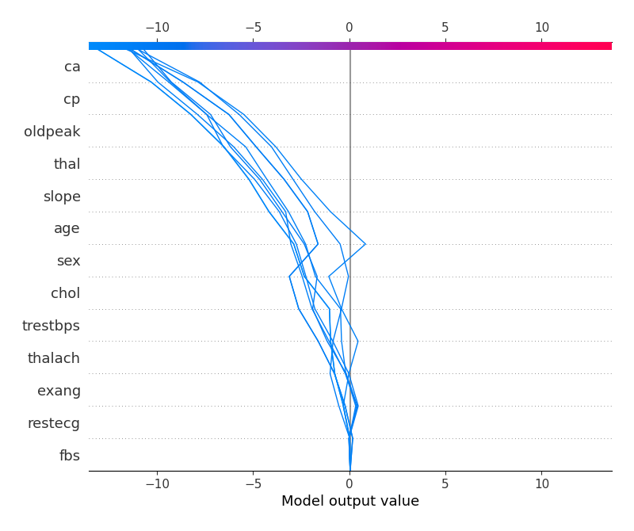
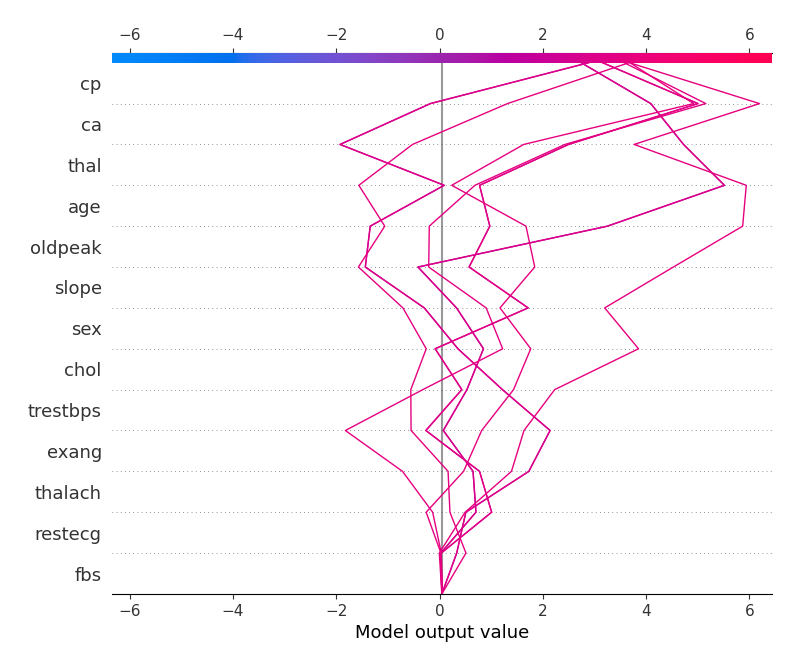
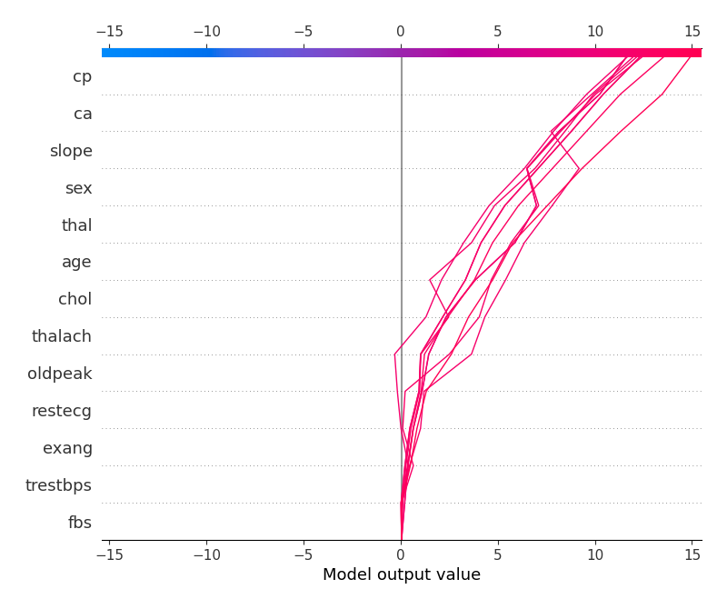

# Summary of 4_Default_Xgboost

[<< Go back](../README.md)

## Extreme Gradient Boosting (Xgboost)
- **n_jobs**: -1
- **objective**: binary:logistic
- **eta**: 0.075
- **max_depth**: 6
- **min_child_weight**: 1
- **subsample**: 1.0
- **colsample_bytree**: 1.0
- **eval_metric**: logloss
- **explain_level**: 2

## Validation
 - **validation_type**: split
 - **train_ratio**: 0.75
 - **shuffle**: True
 - **stratify**: True

## Optimized metric
logloss

## Training time

6.6 seconds

## Metric details
|           |    score |     threshold |
|:----------|---------:|--------------:|
| logloss   | 0.006057 | nan           |
| auc       | 1        | nan           |
| f1        | 1        |   0.0342756   |
| accuracy  | 1        |   0.0342756   |
| precision | 1        |   0.0342756   |
| recall    | 1        |   1.94288e-06 |
| mcc       | 1        |   0.0342756   |

## Metric details with threshold from accuracy metric
|           |    score |   threshold |
|:----------|---------:|------------:|
| logloss   | 0.006057 | nan         |
| auc       | 1        | nan         |
| f1        | 1        |   0.0342756 |
| accuracy  | 1        |   0.0342756 |
| precision | 1        |   0.0342756 |
| recall    | 1        |   0.0342756 |
| mcc       | 1        |   0.0342756 |

## Confusion matrix (at threshold=0.034276)
|              |   Predicted as 0 |   Predicted as 1 |
|:-------------|-----------------:|-----------------:|
| Labeled as 0 |              125 |                0 |
| Labeled as 1 |                0 |              132 |

## Learning curves

## Permutation-based Importance

## Confusion Matrix

## Normalized Confusion Matrix

## SHAP Importance

## SHAP Dependence plots

### Dependence (Fold 1)

## SHAP Decision plots

### Top-10 Worst decisions for class 0 (Fold 1)

### Top-10 Best decisions for class 0 (Fold 1)

### Top-10 Worst decisions for class 1 (Fold 1)

### Top-10 Best decisions for class 1 (Fold 1)

[<< Go back](../README.md)
